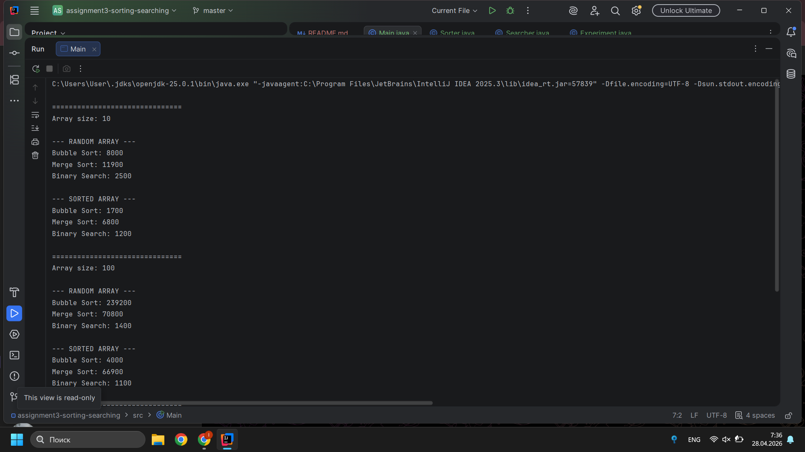
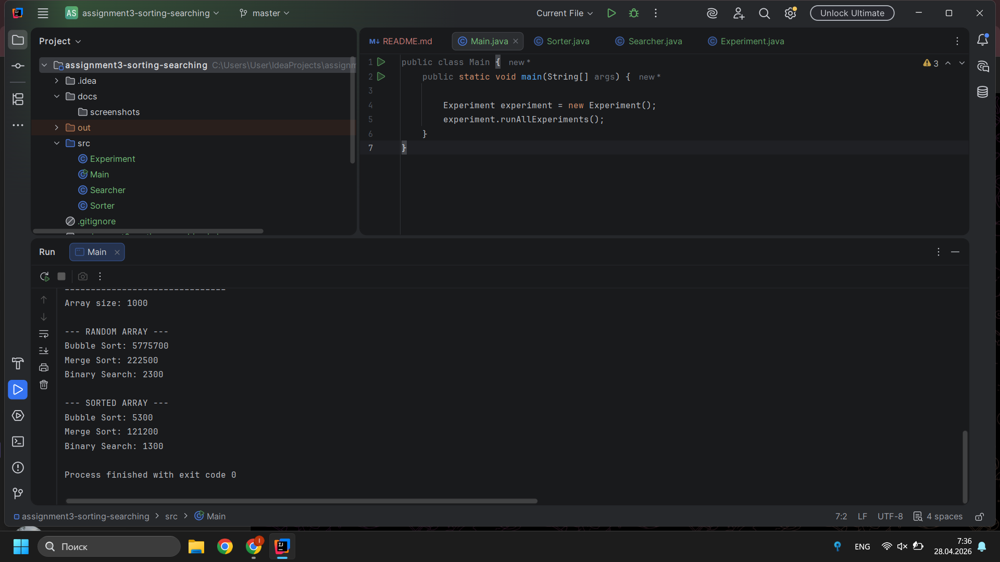

# **Assignment 3: Sorting and Searching Algorithm Analysis**
**Student**: Liliya Akhmedenova

**Group**:BDA-2504

### A. Project Overview

This project focuses on implementing and analyzing sorting and searching algorithms.
The purpose is to compare their performance on different input sizes and data types (random and sorted arrays).

Selected algorithms:

• Bubble Sort (Basic Sorting)

• Merge Sort (Advanced Sorting)

• Binary Search (Searching)

⸻

### B. Algorithm Descriptions

 Bubble Sort: 
Bubble Sort compares adjacent elements and swaps them if they are in the wrong order.

• Time Complexity:

Worst: O(n²)

Average: O(n²)

Best: O(n) (when array is already sorted)

⸻

Merge Sort

Merge Sort uses divide-and-conquer: It splits the array, sorts parts, and merges them.
• Time Complexity:

• Best / Average / Worst: O(n log n)

⸻

🔹 Binary Search

Binary Search finds an element by repeatedly dividing the sorted array in half.

• Time Complexity:
 O(log n)

• Requirement: Array must be sorted

⸻

### Experimental Results

#### Random Arrays

| Array Size | Bubble Sort | Merge Sort | Binary Search |
|-----------|-------------|------------|---------------|
| 10        | 8000        | 11900      | 2500          |
| 100       | 239200      | 70800      | 1400          |
| 1000      | 5775700     | 222500     | 2300          |

⸻

####  Sorted Arrays

| Array Size | Bubble Sort | Merge Sort | Binary Search |
|-----------|-------------|------------|---------------|
| 10        | 1700        | 6800       | 1200          |
| 100       | 4000        | 66900      | 1100          |
| 1000      | 5300        | 121200     | 1300          |

⸻

### D. Analysis

• Bubble Sort performs poorly on random arrays due to O(n²) complexity.

• On sorted arrays, Bubble Sort becomes much faster (close to O(n)).

• Merge Sort performs consistently well regardless of input type.

• As array size increases, Merge Sort becomes significantly faster than Bubble Sort.

• Binary Search is extremely efficient and shows almost constant execution time.

⸻

### E. Screenshots 

### F. Reflection

In this project, I learned how algorithm efficiency impacts performance in real applications.
Bubble Sort is simple but inefficient for large datasets, while Merge Sort is much more scalable.

I also learned that input type (random vs sorted) can affect performance significantly.
This experiment helped me understand the difference between theoretical complexity and actual execution time.

⸻
